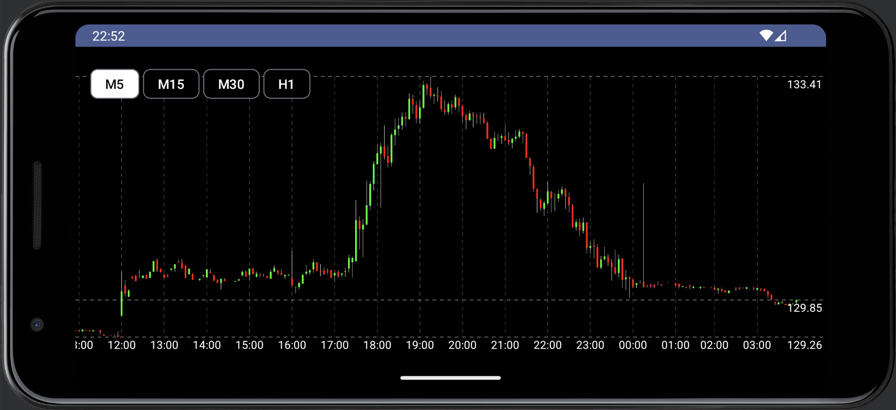
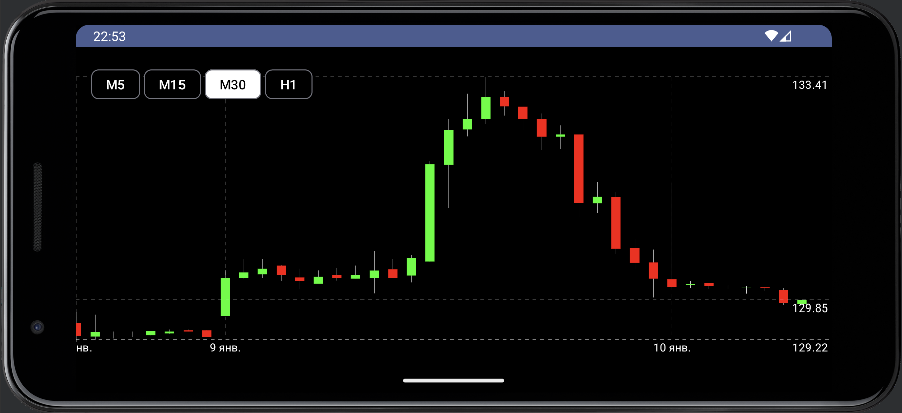

# Terminal

Terminal — это Android-приложение, предназначенное для отображения графиков роста и падения акций. Приложение предоставляет пользователям возможность просматривать графики акций с функцией скроллинга и изменения временных промежутков. Также реализована обработка сетевых ошибок для обеспечения стабильной работы приложения. Для получения информации об акциях используется API [Polygon.io](https://polygon.io).

## Основные функции

- **Отображение графика акций**: Пользователи могут просматривать графики изменения цен на акции.
- **Скроллинг графика**: Возможность прокручивания графика для более детального анализа.
- **Изменение временных промежутков**: Пользователи могут менять timeframe для просмотра данных за различные периоды.
- **Обработка сетевых ошибок**: Приложение эффективно обрабатывает сетевые ошибки и уведомляет пользователей о проблемах с подключением.

## API

Для получения информации об акциях используется [Polygon.io](https://polygon.io).

## Стек используемых библиотек

Приложение разработано с использованием следующих библиотек:

- **Jetpack Compose**: Для создания современного и декларативного пользовательского интерфейса.
- **Retrofit**: Для взаимодействия с API (получение данных о акциях).
- **OkHttpClient**: Для сетевых запросов и обработки сетевых ошибок.

## Скриншоты



## Инструкция по сборке проекта

В файл `gradle.properties` необходимо добавить Api Key в следующем формате:

```
apikey=API_KEY
```

Получить ключ можно на сайте [Polygon.io](https://polygon.io).
